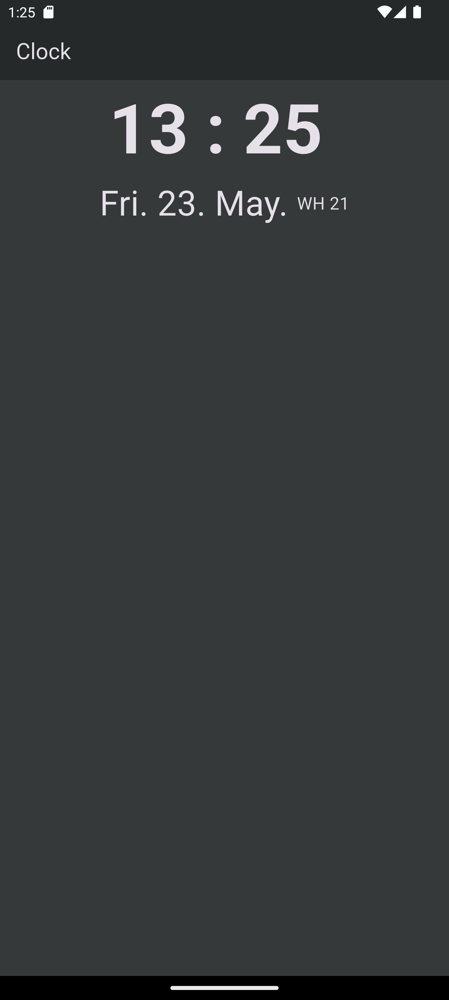
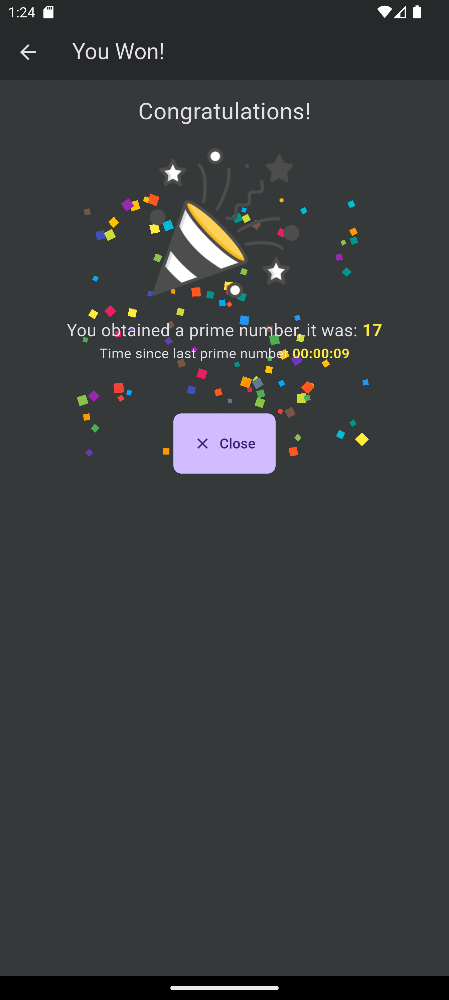

# Clock Application with Finding Prime Number

### Description
We have the right to take legal action in the event that the application is shared on the internet, distribution, claiming right ownership, selling it for a fee.
These codes are shared only for you to learn the Flutter.
Anyone who have access to the codes is agreed to have unconditionally accepted these terms.

All Rights Reserved. 
APPBeta Mobile - www.APPBeta.net - Berk ORHAN BETA

English (EN):
* get: State management and dependency injection.
* provider: State management.
* shared_preferences: Store the time data of prime number.
* intl: Easy format to time and date.
* screenutil: Used for make the text responsive.
  

## About Application
This Flutter application displays a real-time clock on the home screen. Every 10 seconds, it fetches a number from an API, checks if it is a prime number, and responds accordingly:
✅ If prime, the app navigates to a Congratulations Page.
⏱ It stores the time of the last prime detection and shows the time elapsed since then.

- Framework: Flutter
- Programming Language: Dart
- Platform: Android, iOS, Web

## DEMO
Download clock_app.apk [Android APK DEMO](https://github.com/berkorhanbeta/clock_with_prime_number/raw/main/app-release.apk)

## Screenshots from Application

